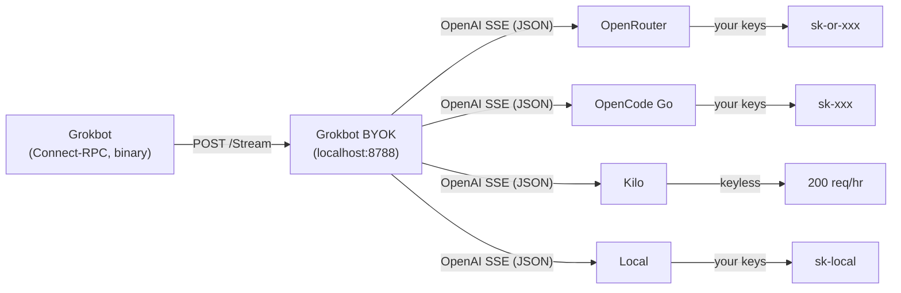
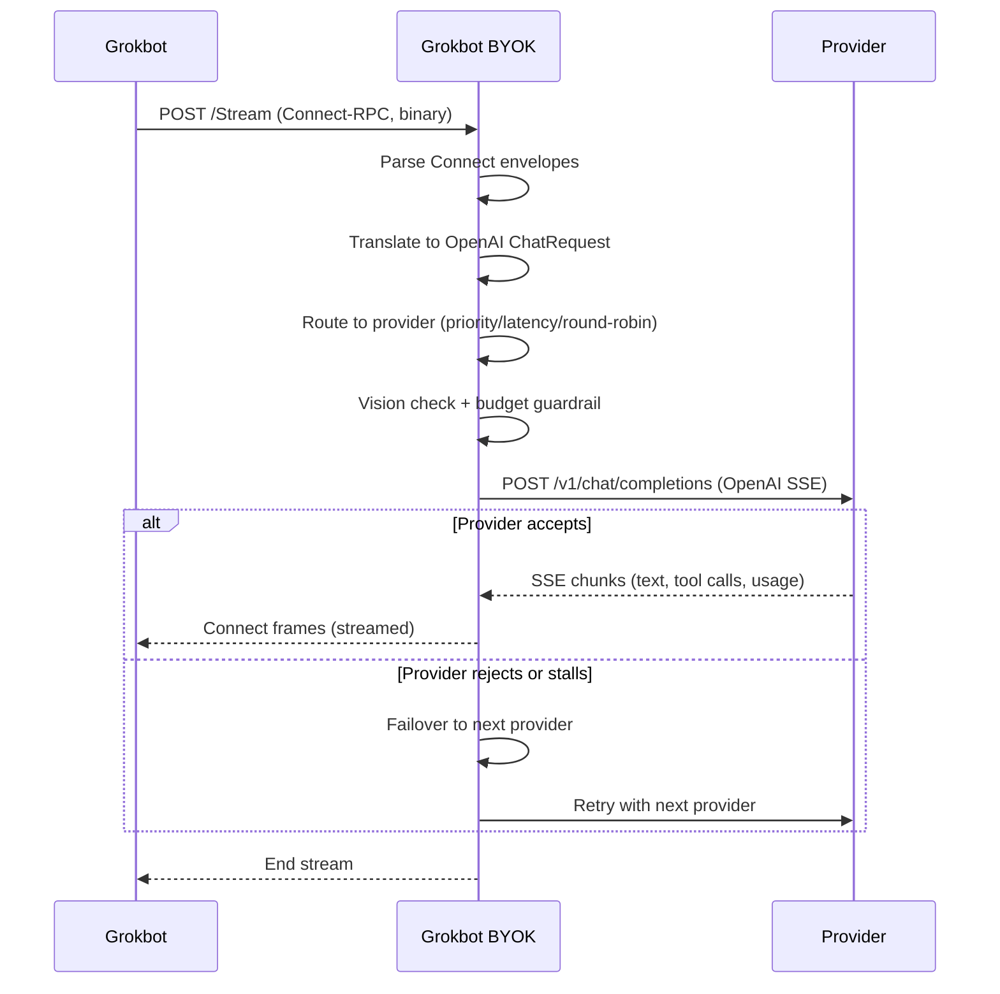
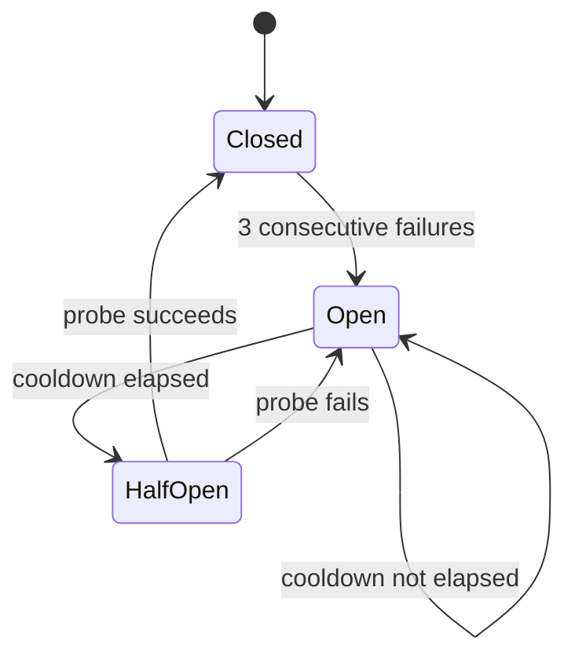

# grokbot-BYOK

[](https://opensource.org/licenses/MIT)
[](https://nodejs.org/)
[](https://www.typescriptlang.org/)
[](#tests)

**Route Grokbot's AI inference through your own LLM API keys.**

Grokbot BYOK is a local proxy that intercepts Grokbot's inference calls
(chat, tab-completion, agent mode) and routes them to any OpenAI-compatible
LLM provider you choose: OpenRouter, OpenCode, Kilo, a local model server,
or all of the above with automatic failover. No more paying for the
hosted backend.

You bring the keys (BYOK = Bring Your Own Key). Grokbot BYOK handles the
rest: protocol translation, routing, failover, and automatic re-patching
when Grokbot updates itself.

---

## Table of contents

- [What it does](#what-it-does)
- [Quick start](#quick-start)
- [How it works](#how-it-works)
- [Providers](#providers)
- [Configuration](#configuration)
- [Managing daemons](#managing-daemons)
- [Uninstall](#uninstall)
- [Routing strategies](#routing-strategies)
- [Failover and circuit breaking](#failover-and-circuit-breaking)
- [Latency-based routing](#latency-based-routing)
- [Session affinity](#session-affinity)
- [Vision fallback](#vision-fallback)
- [Tool call handling](#tool-call-handling)
- [Observability](#observability)
- [Guardrails](#guardrails)
- [Deploy](#deploy)
- [Troubleshooting](#troubleshooting)
- [Tests](#tests)
- [Build](#build)
- [Project structure](#project-structure)
- [License](#license)

---

## What it does

Grokbot talks to Grokbot BYOK (this project) using Connect-RPC, a
gRPC-over-HTTP streaming protocol with binary-framed envelopes. The
backends themselves are OpenAI-compatible chat completion endpoints, but
the wire format is different. Grokbot sends Connect. Providers expect
OpenAI SSE.

Grokbot BYOK sits between them:



Grokbot BYOK:
1. **Receives** Connect-RPC streaming requests from Grokbot
2. **Translates** them to OpenAI chat completion format
3. **Routes** to the best available provider (priority, latency, or round-robin)
4. **Fails over** automatically if a provider errors, rate-limits, or stalls
5. **Translates** the OpenAI SSE response back to Connect frames
6. **Streams** the response back to Grokbot

Grokbot doesn't know the proxy is there. It thinks it's talking to its
normal backend. Grokbot BYOK patches the host bundle (`host-main.cjs`)
to redirect inference calls to `localhost:8788`, and a background watcher
re-applies the patch automatically whenever Grokbot updates itself.

---

## Quick start

### Prerequisites

- Node.js 18+
- A Grokbot account (sign up at grokbot.com)
- At least one LLM API key, or none at all. Kilo is keyless.

### Install

```bash
# 1. Clone
git clone https://github.com/jroth1111/grokbot-BYOK.git
cd grokbot-BYOK

# 2. One-command setup (installs deps, builds, patches Grokbot, starts daemons)
npm run setup -- --openrouter-key sk-or-xxx --opencode-key sk-xxx

# Or with zero API keys (Kilo is keyless, works out of the box):
npm run setup
```

Grokbot's inference now routes through your providers.

### Verifying it works

```bash
npm status                 # Check daemon status (all three should be "running")
tail -20 /tmp/inference-shim.log  # Check the Grokbot BYOK log for errors
node dist/scripts/live-test.js    # Send a test request through Grokbot BYOK
```

If `npm status` shows all daemons running and the live test returns text,
Grokbot BYOK is working. If something failed, check
[Troubleshooting](#troubleshooting).

### API keys

Keys go in `.env` in the project root. You can pass them at setup time or
edit `.env` manually. See [Providers](#providers) for which keys you need.

```bash
# Via CLI flags (written to .env automatically)
npm run setup -- --opencode-key sk-xxx --openrouter-key sk-or-xxx

# Via env vars (written to .env automatically)
OPENCODE_API_KEY=sk-xxx OPENROUTER_API_KEY=sk-or-xxx npm run setup

# Or just edit .env directly
```

### What setup does

The setup script is fully non-interactive and does everything in one step:

1. Checks prerequisites (Node version, dependencies installed)
2. Copies `config/config.example.json` to `config/config.json` (if not present)
3. Copies `.env.example` to `.env` (if not present)
4. Writes API keys from CLI flags / env vars into `.env`
5. Builds Grokbot BYOK + scripts (esbuild to standalone bundles)
6. Starts three background daemons (see [Managing daemons](#managing-daemons))
7. Patches Grokbot's `host-main.cjs` to redirect inference to Grokbot BYOK
8. Runs a smoke test
9. Exits 0 on success, 1 on failure

Re-running `npm run setup` is safe. It stops existing daemons first, then
restarts. It acts as a restart command too.

---

## How it works

### The request lifecycle

Every inference request from Grokbot follows this path through Grokbot BYOK:



<details>
<summary>Detailed step-by-step lifecycle (click to expand)</summary>

```
 1. HTTP receive    Grokbot POSTs a Connect-RPC streaming request to
                    /aiserver.v1.InferenceService/Stream
 2. Parse           Connect envelopes are decoded; the data frame is
                    extracted as proto3 JSON (InferenceStreamRequest)
 3. Translate       The Connect request is converted to an OpenAI
                    ChatCompletion request (messages, tools, images,
                    model config)
 4. Route           The provider registry selects a provider based on
                    the routing strategy and model id
 5. Vision check    If the request has images but the model doesn't
                    support vision, re-route to VISION_FALLBACK_MODEL
 6. Budget check    Pre-flight token budget guardrail (optional)
 7. Connect         Fetch the upstream provider (with retry/backoff,
                    key rotation, circuit breaker checks)
 8. Failover        If the provider rejects or stalls, try the next
                    provider in the failover chain
 9. Stream          Read the OpenAI SSE response, translate each chunk
                    to Connect frames (text, tool calls, usage, thinking)
10. Retry           If the stream produces no content (empty completion),
                    failover to the next provider
11. Respond         Write Connect frames back to Grokbot
```

</details>

Grokbot BYOK writes nothing to the outbound response until a provider accepts
the request, so failover between providers is transparent to Grokbot.

### The host patch

> [!WARNING]
> The setup script modifies Grokbot's `host-main.cjs` in place. A backup
> is saved as `host-main.cjs.bak` so `npm run uninstall` can restore it. If
> you manually delete the backup, you'll need to re-download Grokbot's
> `host-main.cjs` to restore the original file.

Grokbot's inference client lives in a bundled file called `host-main.cjs`
(in the `sand-host` directory). Grokbot BYOK patches this file to:

- Set the default model to your configured model
- Replace the `createCursorInferencePromptSession` function with a
  "routing client" that proxies all `.stream()` calls through the local
  Grokbot BYOK instance (reading the proxy URL from `inference-proxy.url`)

A backup of the original file is saved as `host-main.cjs.bak` so the
uninstall script can restore it.

### The host watcher

Grokbot updates its own `host-main.cjs` periodically (on restart or
update). A background watcher daemon monitors the file and re-applies the
patch automatically when it changes. Grokbot BYOK keeps working across
Grokbot updates without manual intervention.

---

## Providers

Grokbot BYOK routes requests through providers in priority order with automatic
failover. The registry skips providers with missing API keys automatically
(except keyless ones).

### Provider list

| Provider | Env var | Required | Models | Description |
|----------|---------|----------|--------|-------------|
| `openrouter` | `OPENROUTER_API_KEY` | no | stealth/ox-alpha | OpenRouter gateway (many models behind one key) |
| `opencode-go` | `OPENCODE_API_KEY` | yes | ox-alpha-free, qwen3.8-max (vision) | OpenCode Go endpoint. Frontier reasoning, free tier. |
| `kilo` | `KILO_API_KEY` | no (keyless) | stealth/ox-alpha | Kilo gateway. 200 req/hr/IP without a key. |
| `opencode-zen` | `OPENCODE_API_KEY` | no | x-preview-f-free | OpenCode Zen endpoint (shared key with Go) |
| `local` | `LOCAL_API_KEY` | no | glm-5.2, glm-5.1, swe-1-7 | WindsurfAPI on localhost:3003 |

**Default failover order.** `openrouter` then `opencode-go` then `kilo` then `opencode-zen` then `local`.

### Where to get API keys

| Provider | URL | Notes |
|----------|-----|-------|
| OpenCode | https://opencode.ai | One key works for both `opencode-go` and `opencode-zen` |
| Kilo | https://kilo.ai | Optional. Anonymous access works without a key. |
| OpenRouter | https://openrouter.ai/keys | Get a key at the keys page |
| WindsurfAPI | Local | `LOCAL_API_KEY` must match `API_KEY` in WindsurfAPI/.env |

### Where to put API keys

All keys go in `.env` in the project root. Grokbot BYOK sources `.env`
automatically at startup. See `.env.example` for the full template.

```bash
# .env
OPENCODE_API_KEY=sk-your-opencode-key
KILO_API_KEY=your-kilo-key          # optional (keyless works without this)
OPENROUTER_API_KEY=sk-or-v1-your-key
LOCAL_API_KEY=sk-local-test         # must match WindsurfAPI's API_KEY
```

String values in `config/config.json` support `${ENV_VAR}` interpolation, so
the config references keys by env var name.

> [!TIP]
> No secrets go in the config file. All API keys live in `.env` and are
> referenced via `${VAR_NAME}` interpolation in `config.json`. This keeps
> secrets out of git.

---

## Configuration

Config is a single JSON file (`config/config.json`), validated by a zod
schema at startup. Copy `config/config.example.json` to get started.

```json
{
  "port": 8788,
  "host": "127.0.0.1",
  "failover": true,
  "requestTimeoutMs": 30000,
  "routingStrategy": "latency",
  "sessionAffinity": { "enabled": false, "ttlMs": 3600000 },
  "providers": {
    "priority": ["openrouter", "opencode-go", "kilo", "opencode-zen", "local"],
    "configs": { ... }
  },
  "hostConfig": {
    "sandHostDir": "${SAND_HOST_DIR}",
    "defaultModel": "Ox Alpha Free"
  }
}
```

### Per-provider configuration

Each provider in `configs` supports:

| Field | Type | Description |
|-------|------|-------------|
| `baseUrl` | string (URL) | The OpenAI-compatible API endpoint |
| `apiKey` | string | `${ENV_VAR}` reference (resolved from `.env`) |
| `keys` | array | Multiple keys for rotation (optional; see below) |
| `defaultModel` | string | Fallback model when no alias matches |
| `models` | object | Alias to canonical model id map (case-insensitive) |
| `network` | object | Per-provider retry/timeout/circuit config (see below) |
| `compat` | object | Per-provider compat flag overrides (optional) |
| `keyless` | boolean | Include in routing even if apiKey is empty |

### Network configuration (per provider)

| Field | Default | Description |
|-------|---------|-------------|
| `requestTimeoutMs` | 30000 | HTTP request timeout (ms) |
| `maxRetries` | 0 | Retries within this provider before failing over |
| `retryBackoffInitialMs` | 500 | Initial exponential backoff (ms) |
| `retryBackoffMaxMs` | 5000 | Backoff cap (ms) |
| `streamIdleTimeoutMs` | 120000 | Close stream if no data for this long (ms) |
| `ttfbTimeoutMs` | 15000 | Abort and failover if no first token within this (ms; 0 disables) |
| `rateLimitCooldownMs` | 10000 | Circuit cooldown after 429 (ms) |
| `serverErrorCooldownMs` | 30000 | Circuit cooldown after 5xx (ms) |
| `failureThreshold` | 3 | Consecutive failures before circuit opens |

### Multiple API keys (key rotation)

A provider can hold multiple keys for load distribution and failover:

```json
{
  "openrouter": {
    "baseUrl": "https://openrouter.ai/api/v1",
    "keys": [
      { "value": "${OPENROUTER_KEY_1}", "weight": 2 },
      { "value": "${OPENROUTER_KEY_2}", "weight": 1 }
    ],
    "defaultModel": "stealth/ox-alpha",
    "models": { ... }
  }
}
```

Keys rotate round-robin. A key that returns 401/403 is marked failed and
removed from rotation. When all keys fail, the set resets so they get
another chance.

### Environment variables

<details>
<summary>Full env var reference (click to expand)</summary>

| Variable | Default | Description |
|----------|---------|-------------|
| `OPENCODE_API_KEY` | none | OpenCode Go + Zen API key |
| `KILO_API_KEY` | none | Kilo gateway key (optional, keyless works without it) |
| `OPENROUTER_API_KEY` | none | OpenRouter API key |
| `LOCAL_API_KEY` | `sk-local-test` | Must match WindsurfAPI's `API_KEY` |
| `WINDSURF_API_KEY` | none | Override Devin session token (auto-read from credentials.toml if unset) |
| `DROUGHT_RESTRICT_PREMIUM` | `0` | Disable WindsurfAPI's stale premium gate |
| `VISION_FALLBACK_MODEL` | `qwen3.8-max` | Re-route image requests to this vision-capable model |
| `SHIM_PORT` | `8788` | Override listen port |
| `SHIM_HOST` | `127.0.0.1` | Override listen host |
| `SHIM_FAILOVER` | `true` | Set to `0` to disable provider failover |
| `SHIM_LOG_DIR` | none | Directory for tool-schema dumps (empty = disabled) |
| `SAND_HOST_DIR` | `$HOME/sand-host` | Grokbot sand-host directory (where host-main.cjs lives) |
| `CAPTURE_BODIES` | `false` | Log request/response bodies for debugging |
| `REQUEST_MAX_TOKENS_BUDGET` | `0` (off) | Per-request token cost ceiling |
| `MAX_CONSECUTIVE_UPSTREAM_FAILS` | `0` (off) | Stop failover after N consecutive failures |
| `VALIDATE_TOOL_ARGUMENTS` | `false` | Validate tool call args against schemas |

</details>

> [!NOTE]
> **WindsurfAPI** is a local LLM server that runs on `127.0.0.1:3003`. It
> serves GLM and SWE models using the Devin CLI's session token for auth.
> The `local` provider in the default config points at it. If you don't
> have WindsurfAPI installed, Grokbot BYOK still works with the other
> providers. The `start-shim` launcher tries to auto-start WindsurfAPI
> from `../WindsurfAPI` if the local provider is configured and nothing
> is listening on port 3003.

---

## Managing daemons

```bash
npm run setup              # Start/restart everything (builds, stops old, starts new)
npm run setup -- --status  # Check daemon status (exit 0 if all running, 1 if not)
npm run setup -- --stop    # Stop all daemons
npm run setup -- --no-build # Restart without rebuilding (same as npm start)
npm run setup -- --no-watch # Start without host watcher
npm run setup -- --quiet   # Minimal output (agent-friendly)
npm start                  # Start/restart all daemons (no rebuild, re-patches host)
npm stop                   # Stop all daemons
npm status                 # Check daemon status
```

### Daemon processes

| Daemon | PID file | Log file | Purpose |
|--------|----------|----------|---------|
| Grokbot BYOK | `/tmp/inference-shim.pid` | `/tmp/inference-shim.log` | The inference proxy itself (port 8788) |
| Host watcher | `/tmp/grokbot-watch-host.pid` | `/tmp/grokbot-watch-host.log` | Re-patches Grokbot's host bundle when it updates |
| Health watchdog | `/tmp/grokbot-health-check.pid` | `/tmp/grokbot-health-check.log` | Monitors Grokbot BYOK health, auto-redeploys on failure |

The host watcher is what makes re-attachment robust. When Grokbot's
supervisor updates or reinstalls `host-main.cjs`, the watcher detects the
change, re-applies the routing-client patch, and restarts the host process.
This happens automatically. No manual intervention needed after Grokbot
updates.

The health watchdog parses Grokbot BYOK's log to compute an error rate over a
rolling 5-minute window. If the error rate exceeds 50%, it runs the deploy
script to rebuild and restart. A deploy cooldown (5 minutes) prevents
deploy storms.

### Checking logs

```bash
tail -f /tmp/inference-shim.log        # Live shim log (requests, routing, errors)
tail -f /tmp/grokbot-watch-host.log    # Host watcher log (patch events)
tail -f /tmp/grokbot-health-check.log  # Health watchdog log (health status)
```

All logs are JSON lines. Pipe through `jq` for readable output:

```bash
tail -100 /tmp/inference-shim.log | jq 'select(.level=="error")'
```

---

## Uninstall

```bash
# Stop daemons, remove PID/log files, restore Grokbot's host-main.cjs
npm run uninstall

# Full removal: also delete .env, config.json, dist/, node_modules/
npm run uninstall -- --purge

# Quiet mode (agent-friendly)
npm run uninstall -- --quiet

# Leave the host patch in place (don't restore host-main.cjs)
npm run uninstall -- --keep-host
```

The uninstall script:
- Stops all three daemons (Grokbot BYOK, host watcher, health watchdog)
- Removes all PID files and log files from `/tmp/`
- Restores Grokbot's `host-main.cjs` from the `.bak` backup (if one exists)
- Removes the `inference-proxy.url` file and deployed Grokbot BYOK symlink
- With `--purge`: also removes `.env`, `config/config.json`, `dist/`, `node_modules/`
- The git repository itself is preserved. Delete the directory manually if needed.

---

## Routing strategies

Set `routingStrategy` in `config/config.json`:

| Strategy | Behavior |
|----------|----------|
| `priority` | First provider (in priority order) that can handle the model wins. All traffic goes to the highest-priority provider until it fails. |
| `latency` | Routes to the provider with the best combined TTFB + throughput score. Uses epsilon-greedy exploration and shadow probes to keep scores fresh. Recommended. |
| `round-robin` | Rotates through providers that can handle the model in round-robin fashion. |
| `weighted-round-robin` | Smooth weighted round-robin (SWRR) using each provider's first key weight. |
| `fill-first` | Same as `priority`. |

If no provider claims the model id, the first provider in the priority list
is used as the default fallback.

---

## Failover and circuit breaking

When `failover: true` (default), Grokbot BYOK tries providers in priority order
until one succeeds. Each provider has an independent circuit breaker:



The circuit states:

- After 3 consecutive failures (configurable via `failureThreshold`), the
  circuit opens and the provider is skipped
- After the cooldown elapses (10s for rate limits, 30s for server errors),
  one half-open probe is allowed
- If the probe succeeds, the circuit closes
- If the probe fails, the circuit stays open for another cooldown period

Error classification determines whether to retry, failover, or stop:

| Error type | HTTP status | Action |
|------------|-------------|--------|
| `request-error` | 400, 404, 405, 413, 422 | Stop. Will fail on every provider. |
| `auth-error` | 401, 402, 403 | Rotate key, then failover |
| `rate-limit` | 429 | Retry with backoff, then failover |
| `server-error` | 5xx | Retry with backoff, then failover |
| `network-error` | timeout, connection reset | Retry with backoff, then failover |
| `empty-completion` | 200 but no content | Failover to next provider |
| `invalid-tool-arguments` | 200 but bad tool calls | Failover to next provider |

### Cross-provider failover on empty completion

If a provider returns a 200 response but produces no content (empty
completion), Grokbot BYOK fails over to the next provider instead of returning
an empty response. This handles providers that accept the request but
silently produce nothing, a common failure mode for free-tier endpoints.

If the client disconnects during a stream, the failover loop stops
immediately. No point burning upstream provider quota on a response no one
will receive.

---

## Latency-based routing

When `routingStrategy: "latency"`, Grokbot BYOK maintains per-provider
performance scores using exponentially-weighted moving averages (EWMA) of
three signals:

- **Prefill speed.** TTFB divided by prompt tokens (ms per prompt token).
- **Decode speed.** Completion tokens divided by generation duration (tokens/sec).
- **Error rate.** Fraction of failed requests.

The combined score projects each provider's rates onto a reference workload
(rolling average of actual request sizes) to answer one question: "If I
sent my average-sized request to each provider, which would finish first?"

```
score = (prefillMsPerPromptToken × refPromptTokens
       + 1000 / tokensPerSec × refCompletionTokens)
       × (1 + errorRate × 0.2)
       × stalenessDecay
```

Lower is better. Four things keep the scores honest:

- **Epsilon-greedy exploration.** 10% of requests go to a random provider
  to keep scores fresh and discover faster providers.
- **Shadow probes.** Every 50th request, a concurrent probe goes to the
  second-best provider to calibrate scores with apples-to-apples data.
- **Staleness decay.** Providers with old data get a reduced score to
  encourage re-sampling.
- **Client-disconnect awareness.** Client-side aborts don't count as
  provider failures, so error rates stay clean.

---

## Session affinity

When `sessionAffinity.enabled: true`, Grokbot BYOK binds a session ID (derived
from the request's `invocationId`) to a provider so subsequent requests from
the same conversation go to the same provider. This preserves server-side
prompt caching and conversation continuity.

Bindings expire after `ttlMs` (default: 1 hour). A cleanup sweep runs
every 5 minutes.

---

## Vision fallback

When a request contains images but the resolved model doesn't support
vision, Grokbot BYOK re-routes to `VISION_FALLBACK_MODEL` (default:
`qwen3.8-max`) instead of silently stripping the images. If no fallback
model is configured, Grokbot BYOK replaces images with a placeholder text and
sends the request to the original model.

Vision support is auto-detected per model based on the model id and provider
(see `detectSupportsImages` in `src/providers/compat.ts`).

---

## Tool call handling

Grokbot BYOK handles tool calls across the Connect to OpenAI translation
boundary:

- **Tool call accumulation.** OpenAI streams tool calls as deltas spread
  across multiple SSE chunks. The accumulator merges them into complete
  tool calls and emits them as Connect `toolCallPart` frames.
- **Argument repair.** Streaming JSON arguments that are split mid-token are
  repaired using a streaming JSON parser.
- **Inline tool-call rescue.** When a model emits tool calls as text in a
  non-standard dialect (Kimi `<|tool_call_begin|>`, DeepSeek DSML, Qwen
  `<tool_calls>` XML), Grokbot BYOK detects and re-parses them into structured
  tool calls.
- **Markup healing.** A streaming filter strips leaked chat-template markup
  from visible content and reconstructs tool calls and reasoning from it.
- **Schema validation** (optional, `VALIDATE_TOOL_ARGUMENTS=true`). Validates
  flushed tool calls against their JSON schemas. Definite violations trigger
  failover to the next provider.

---

## Observability

### Structured logging

All logs are JSON lines with a timestamp, level, message, and structured
fields. Every request gets a unique `requestId` injected into all log lines
for that request, so you can trace a single request through the full
lifecycle.

### Credential redaction

API keys are redacted from all log output at the console level. No
`sk-*`, `gsk_*`, `AIza*`, Bearer token, or JWT ever reaches stdout, even
from code that hasn't been written yet.

### Metrics

Grokbot BYOK logs per-provider metrics every 5 minutes:

```json
{"msg":"provider metrics","provider":"openrouter","requests":16,
 "successes":16,"errors":0,"errorRate":0,"avgLatencyMs":33962,
 "avgTtfbMs":13754,"latencyHistogram":{...}}
```

When `routingStrategy: "latency"`, it also logs per-provider performance
scores:

```json
{"msg":"provider performance","provider":"openrouter","samples":16,
 "avgPrefillMsPerPromptToken":0.12,"avgTokensPerSec":89.2,
 "errorRate":0.0,"score":1234.56,"ageMs":5000,
 "refPromptTokens":10000,"refCompletionTokens":500}
```

### Body capture (debug)

Set `CAPTURE_BODIES=true` to log truncated request/response bodies for
debugging. Bodies are truncated to `CAPTURE_MAX_BYTES` (default 4096).
Tool-call arguments are NOT redacted. This is a debugging tool, not a
production log.

### Process safety net

A process-level safety net catches unhandled errors and rejections.
Transient transport errors (ECONNRESET, UND_ERR_SOCKET) are swallowed. A
CDN edge resetting a socket must never crash the process. Everything else
(programming bugs) stays fatal (exit 1) to surface loudly.

---

## Guardrails

Two optional hard limits, both off by default:

1. **Token budget** (`REQUEST_MAX_TOKENS_BUDGET`). Pre-flight check that
   estimated input plus requested output fits within a per-request token
   ceiling. Oversized requests get a 413 before any provider is tried.
   Requests without an explicit `max_tokens` have their output capped to
   the budget remainder instead of being rejected.

2. **Consecutive failure breaker** (`MAX_CONSECUTIVE_UPSTREAM_FAILS`). Stops
   the failover chain after N consecutive upstream failures, returning a 503
   instead of grinding through a pool that's failing across the board.

---

## Deploy

> [!IMPORTANT]
> You rarely need to run deploy manually. Use `npm run setup` for normal
> restarts. The health watchdog calls deploy automatically when Grokbot BYOK's
> error rate exceeds 50%.

For advanced deployment (atomic rebuild with symlink swap and host restart):

```bash
# Full deploy: typecheck, build, stop old, symlink, start, patch host, test
node dist/scripts/deploy.js

# Copy instead of symlink
node dist/scripts/deploy.js --copy

# Skip host restart
node dist/scripts/deploy.js --no-restart
```

The health watchdog calls this script automatically when Grokbot BYOK's error
rate exceeds 50%. You rarely need to run it manually. Use `npm run setup`
for normal restarts instead.

---

## Troubleshooting

### Setup failed

Check the setup output for the specific error. Common causes:

- **Missing API keys.** The setup script exits with a message showing which
  keys are needed and how to provide them. Kilo is keyless, so `npm run
  setup` with no keys still works.
- **Node version too old.** Requires Node 18+. Check with `node --version`.
- **Port 8788 in use.** Another process is holding the port. Stop it or set
  `SHIM_PORT` to a different value in `.env`.
- **Grokbot not found.** The setup script looks for `host-main.cjs` in
  `$HOME/sand-host`. If your Grokbot `host-main.cjs` is in a different
  location, set `SAND_HOST_DIR` in `.env`.

### Grokbot's inference stopped working

```bash
npm status                                    # Are the daemons running?
tail -50 /tmp/inference-shim.log | jq 'select(.level=="error")'  # Any errors?
```

If Grokbot BYOK crashed, the health watchdog should auto-redeploy within 5
minutes. If it didn't, run `npm run setup` to restart everything.

If the host patch was lost (Grokbot updated and the watcher didn't catch
it), run `npm run setup` to re-patch.

### All providers failing

```bash
tail -100 /tmp/inference-shim.log | jq 'select(.msg=="all providers failed")'
```

Check which providers are in the failover chain and whether their API keys
are valid. A 401/403 means the key is bad. A 429 means rate limited (wait
for the cooldown). A 5xx means the provider is down (the circuit breaker
will skip it after 3 failures).

### Provider not in the failover chain

The registry skips providers whose API key is empty or unresolved (the
`${VAR}` literal remains because the env var isn't set). Check that the
key exists in `.env` and that the env var name in `config.json` matches.

### Grokbot BYOK is running but Grokbot doesn't use it

The host patch may have been lost. Verify:

```bash
# Check if the proxy URL file exists
ls -la $HOME/sand-host/inference-proxy.url

# Check if host-main.cjs has the routing client patch
grep -c "routingClient" $HOME/sand-host/host-main.cjs
```

If either is missing, run `npm run setup` to re-patch.

---

## Tests

```bash
npm test              # Run all 359 tests
npm run test:watch    # Watch mode
npm run typecheck     # Type check only (tsc --noEmit)
```

The test suite covers:
- Protocol encoding/decoding (Connect envelopes, edge cases)
- Request/response translation (Connect to OpenAI and back)
- Provider routing (priority, latency, round-robin, weighted)
- Circuit breaker and failover logic
- Retry with backoff
- Session affinity
- Stream timeout handling
- Performance tracker scoring (EWMA, sentinel handling, staleness)
- Server integration (full HTTP lifecycle with mock upstreams)
- End-to-end (real Grokbot BYOK server, real HTTP requests)
- Client-disconnect failover behavior
- Config validation

---

## Build

```bash
npm run build         # Build Grokbot BYOK only (dist/shim.js)
npm run build:all     # Build Grokbot BYOK + scripts (dist/shim.js + dist/scripts/*.js)
npm run clean         # Remove dist/
```

The build uses esbuild to produce standalone bundled `.js` files with no
runtime dependencies (except `ajv` and `zod`, which are bundled in).
Grokbot BYOK is a single `dist/shim.js` file that can run anywhere Node 18+ is
available.

---

## Project structure

<details>
<summary>Full file tree (click to expand)</summary>

```
src/
  shim.ts                       Entry point (PID lock, startup, shutdown)
  server.ts                     HTTP server, the request lifecycle
  config.ts + config/schema.ts  Config loader + zod validation
  log.ts                        Structured JSON logger
  types.ts                      Shared types (Provider, ShimConfig, etc.)
  protocol/                     Connect-RPC codec, SSE parser, proto3 helpers
  translate/                    Connect to OpenAI translation (request, response,
                                tools, vision, think-tags, markup healing)
  providers/                    Provider registry, routing, circuit breaker,
                                retry, latency scoring, session affinity
  observability/                Metrics, logging, error classification,
                                guardrails, credential redaction
  utils/                        Daemon management, .env loader, JSON repair
scripts/
  setup.ts                      One-command setup
  start-shim.ts                 Grokbot BYOK launcher (WindsurfAPI auto-start)
  deploy.ts                     Atomic deploy (build, symlink, restart)
  patch-host.ts                 Host bundle patcher
  watch-host.ts                 Bundle watcher (auto re-patch)
  health-check.ts               Health watchdog (auto-deploy on failure)
  uninstall.ts                  Uninstall
config/
  config.example.json           Example config with all providers
test/
  13 test files, 359 tests
```

</details>

---

## License

MIT
